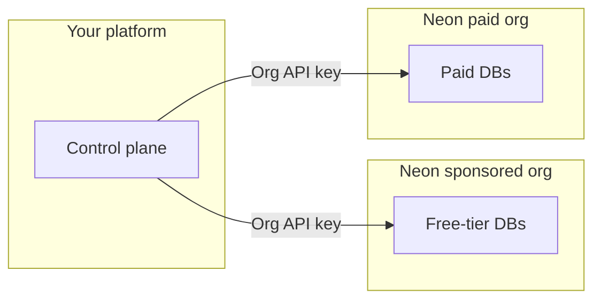

# Neon for Agent Platforms

Sample code and a companion Agent Skill for the Neon AI Agent Program,
targeting products that provision and operate Neon Postgres for their users
(agent platforms, codegen tools, multi-tenant SaaS).

**Scope:**
Use this repo for Agent Program orchestration (dual-org fleets, project
transfer, per-tenant provisioning, compound checkpoints, and Consumption
API). For connection strings, drivers, ORMs, and general Neon app
integration, use the
[neon-postgres skill](https://github.com/neondatabase/postgres-skills)
and [Neon docs](https://neon.com/docs) first.

Official Neon docs:

- [Agent Plan](https://neon.com/docs/introduction/agent-plan)
- [AI Agent integration](https://neon.com/docs/guides/ai-agent-integration)
- [Database versioning](https://neon.com/docs/ai/ai-database-versioning)

---

## Quick start

### 1. Install the skills

Install the primary Neon skill from [neondatabase/agent-skills](https://github.com/neondatabase/agent-skills), then this repo’s companion skill (it is not bundled in agent-skills):

```bash
npx skills add neondatabase/agent-skills -s neon-postgres
npx skills add neondatabase/neon-for-agent-platforms -s neon-postgres-agent-platforms
```

### 2. Clone and run

```bash
git clone https://github.com/neondatabase/neon-for-agent-platforms.git
cd neon-for-agent-platforms/scripts
npm install
cp .env.example .env
npm run build
# Set NEON_API_KEY (see .env.example)

npm run neon:list-projects
npm run branch -- list
npm run consumption
npm run auth-users -- meta
npm run versioning-flow # NEON_API_KEY + NEON_PROJECT_ID in .env
```

---

## Fleet and org model (summary)

Partners typically run two Neon organizations so free-tier users and paying customers land in separate pools. Your control plane picks which org when creating a tenant project; upgrades often mean transferring into the paid org and raising quotas. Use organization API keys per org and a personal API key for cross-org transfer.


| Org                    | Typical role                                                                               |
| ---------------------- | ------------------------------------------------------------------------------------------ |
| **Sponsored free org** | Free-tier end users (within program rules on [neon.com](https://neon.com))                 |
| **Paid org**           | Paying customers (metered per [Agent Plan](https://neon.com/docs/introduction/agent-plan)) |





## Repository layout

```
neon-for-agent-platforms/
├── LICENSE
├── README.md
├── scripts/                           # Runnable TS samples (npm run build)
└── skills/neon-postgres-agent-platforms/
    ├── SKILL.md                       
    └── references/                    # Docs + symlinked script sources
```


| Path                                    | Purpose                                                      |
| --------------------------------------- | ------------------------------------------------------------ |
| `scripts/`                              | Runnable `@neondatabase/api-client` samples                  |
| `skills/neon-postgres-agent-platforms/` | Companion agent skill, reference docs, and symlinked sources |


---

## Support

- Agent Program: shared Slack with Neon
- [agents@neon.tech](mailto:agents@neon.tech) for limits and account requests (include org IDs)
- [neon.com/docs](https://neon.com/docs)

## License

Apache 2.0 — see [LICENSE](LICENSE).
