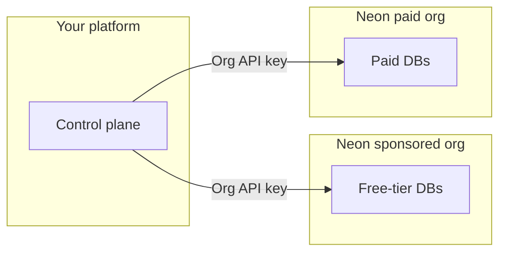

# Neon for Agent Platforms

Sample code and a companion Agent Skill for the [Neon AI Agent Program](https://neon.com/use-cases/ai-agents). It targets products that **provision and operate Neon Postgres for their users** (agent platforms, codegen tools, multi-tenant SaaS).

**Scope:** control-plane and fleet patterns (orgs, provisioning, branching, snapshots, transfer, consumption). For connection strings, drivers, ORMs, and general Neon app integration, use the **`neon-postgres`** skill and [Neon docs](https://neon.com/docs) first, then this repo for Agent Program orchestration.

Official Neon docs: [Agent Plan](https://neon.com/docs/introduction/agent-plan), [AI Agent integration](https://neon.com/docs/guides/ai-agent-integration), [Database versioning](https://neon.com/docs/ai/ai-database-versioning).

---

## Clone and run

```bash
git clone https://github.com/neondatabase/neon-for-agent-platforms.git
cd neon-for-agent-platforms/examples/api-scripts
npm install
cp .env.example .env
# Set NEON_API_KEY (see .env.example)

npm run neon:list-projects
npm run branch -- list
npm run consumption
npm run auth-users -- meta
npm run versioning-flow   # NEON_API_KEY + NEON_PROJECT_ID in .env
```

---

## Fleet and org model (summary)

Partners typically run **two Neon organizations** so free-tier users and paying customers land in separate pools. Your control plane picks **which org** when creating a tenant project; upgrades often mean [transferring](https://neon.com/docs/manage/orgs-project-transfer) into the paid org and raising quotas. Use **organization API keys** per org and a **personal API key** for cross-org transfer. Neon recommends **one Neon project per customer app**.

| Org | Typical role |
| --- | ------------ |
| **Sponsored free org** | Free-tier end users (within program rules on [neon.com](https://neon.com)) |
| **Paid org** | Paying customers (metered per [Agent Plan](https://neon.com/docs/introduction/agent-plan)) |



How scripts, env vars, and npm commands map to these flows: **[MANAGEMENT_API_SAMPLES.md](examples/api-scripts/MANAGEMENT_API_SAMPLES.md)** and the [AI Agent integration guide](https://neon.com/docs/guides/ai-agent-integration). For checkpoints and metadata beyond Neon IDs, see [Compound checkpoints](examples/api-scripts/reference-architecture/COMPOUND_CHECKPOINTS_FOR_AGENT_PLATFORMS.md).

---

## Agent Skills in your editor

```bash
npx skills add neondatabase/agent-skills -s neon-postgres
npx skills add neondatabase/agent-skills -s neon-postgres-agent-platforms
```

Alternatively: `npx neonctl@latest init` ([Agent Skills on Neon](https://neon.com/docs/ai/agent-skills)).

---

## Repository layout

This repo follows the [Agent Skills directory model](https://agentskills.io/home#what-are-agent-skills). The companion skill is **`skills/neon-postgres-agent-platforms/`**; runnable samples live in **`examples/api-scripts/`** (not inside the skill folder).

```
neon-for-agent-platforms/
├── examples/api-scripts/              # Runnable Management API samples
└── skills/neon-postgres-agent-platforms/
    ├── SKILL.md
    ├── references/
    └── …
```

| Path | Purpose |
| ---- | ------- |
| [`examples/api-scripts/`](examples/api-scripts/) | [`@neondatabase/api-client`](https://www.npmjs.com/package/@neondatabase/api-client) samples. Build and run via **`npm run …`** ([MANAGEMENT_API_SAMPLES.md](examples/api-scripts/MANAGEMENT_API_SAMPLES.md)). |
| [`skills/neon-postgres-agent-platforms/`](skills/neon-postgres-agent-platforms/) | Companion skill ([SKILL.md](skills/neon-postgres-agent-platforms/SKILL.md)). Use with [neon-postgres](https://github.com/neondatabase/agent-skills). |

---

## Reference

| Resource | Notes |
| -------- | ----- |
| [MANAGEMENT_API_SAMPLES.md](examples/api-scripts/MANAGEMENT_API_SAMPLES.md) | Catalog, env vars, flows |
| [`reference-architecture/`](examples/api-scripts/reference-architecture/) | Architectural patterns, app-level curl examples, and compound checkpoint guidance (not runnable Neon SDK scripts) |
| [SKILL.md](skills/neon-postgres-agent-platforms/SKILL.md) | Companion skill text |
| [Agent Skills repo](https://github.com/neondatabase/agent-skills) | `neon-postgres` bundle |
| [AI Agent Platforms](https://neon.com/use-cases/ai-agents) | Program overview |
| [API reference](https://api-docs.neon.tech) | Management API |

**Requirements:** Node **20+** recommended (`node --env-file=.env`). [Neon API key](https://neon.com/docs/manage/api-keys) (`NEON_API_KEY`). Org-scoped keys often need `NEON_ORG_ID` (see **MANAGEMENT_API_SAMPLES.md**).

---

## Contributing

At repo root: `npm install`, `npm run fmt:check`, `npm run typecheck`. Format: `npm run fmt`. See [AGENTS.md](AGENTS.md).

---

## Support

- Agent Program: shared Slack with Neon
- [agents@neon.tech](mailto:agents@neon.tech) for limits and account requests (include org IDs)
- [HIPAA on Neon](https://neon.com/docs/security/hipaa) (Agent Plan)
- [neon.com/docs](https://neon.com/docs)

## License

Apache 2.0. See [LICENSE](LICENSE).
